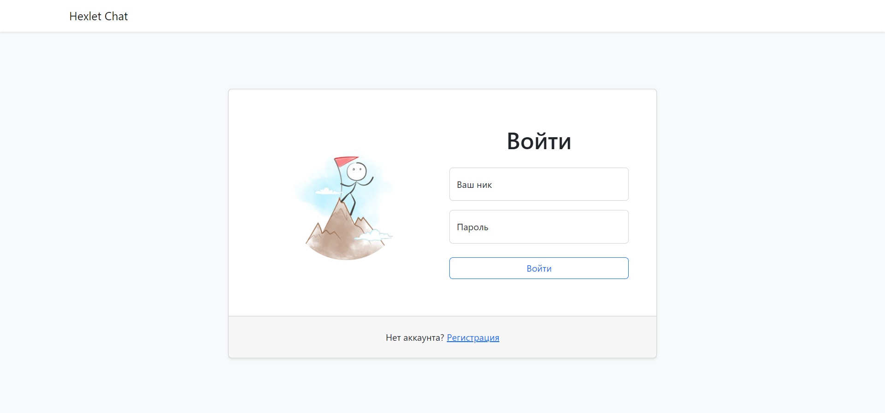
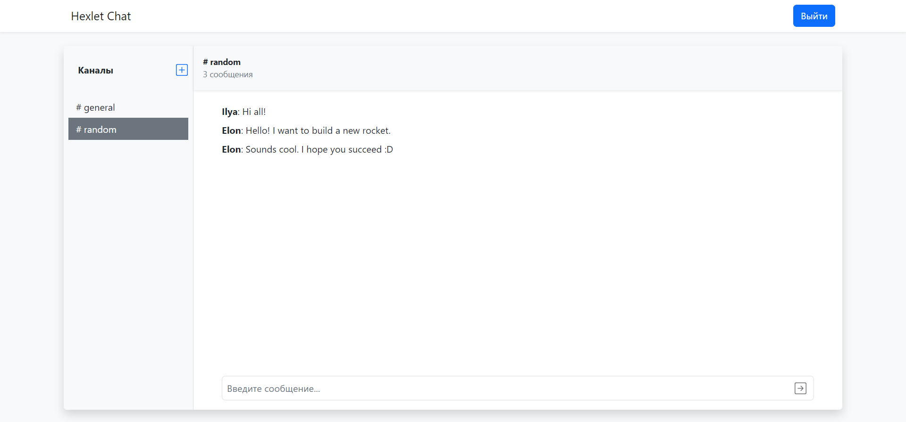
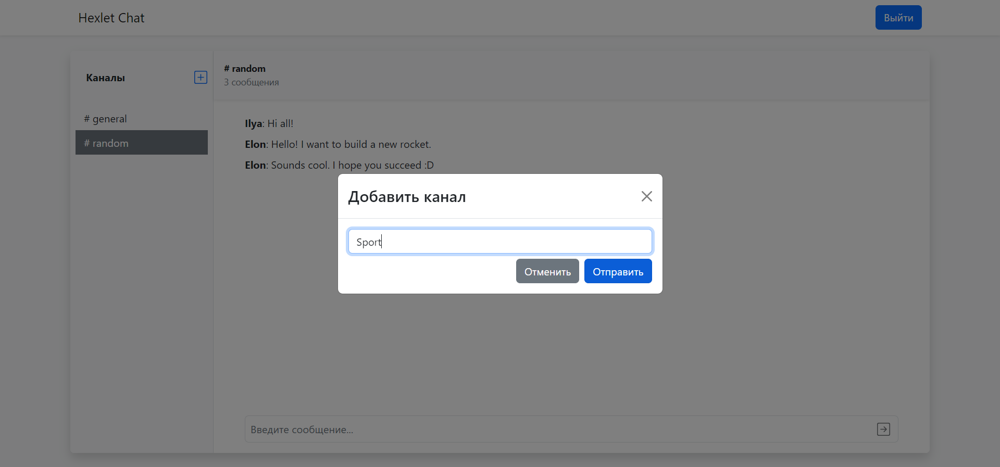

[](https://nodejs.org/en)
[](https://github.com/Frit027/frontend-project-12/actions)

<h1>
    <div align="right">
        <a href="README.md"></a>
        <code><a href="#"></a></code>
    </div>
    Web Chat
</h1>

## Описание
Репозиторий содержит клиентскую часть веб-чата с групповыми каналами.  
Данное веб-приложение представляет собой список общих каналов (чатов), доступных всем зарегистрированным пользователям.  
После регистрации пользователь может общаться в доступных чатах, а также сам создавать каналы.  
Созданные каналы можно переименовывать и удалять.

## Примеры работы веб-приложения
Ниже представлены некоторые примеры работы веб-чата.
### Страница входа

### Общий чат

### Создание нового канала для общения


## Установка и использование
Клонируйте данный репозиторий.  
Внутри директории [frontend](frontend) выполните следующую команду:
```shell
npm i
```
В корне проекта выполните следующие команды:
```shell
npm i
npm run build
npm start
```
Откройте http://localhost:5001.

## Зависимости
- **Node.js** v16.17.1 или более новая версия;
- код сервера, хранящийся в отдельном [репозитории](https://github.com/hexlet-components/project-js-chat-backend).

## Используемые технологии и инструменты
### Основные технологии:
- [ECMAScript 2021](https://www.w3schools.com/js/js_2021.asp)
- [React](https://react.dev) `[18.2.0]`
- [Redux Toolkit](https://redux-toolkit.js.org) `[1.9.3]`
- [socket.io](https://socket.io) `[4.6.1]` - WebSocket-клиент для обмена сообщениями
### Визуальное оформление:
- [Bootstrap](https://getbootstrap.com) `[5.0]`
### Дополнительные инструменты:
- [i18next](https://www.i18next.com) - Фреймворк для интернационализации
- [leo-profanity](https://github.com/jojoee/leo-profanity) - Фильтр ненормативной лексики
- [Rollbar React](https://docs.rollbar.com/docs/react) - Сервис для отслеживания ошибок
