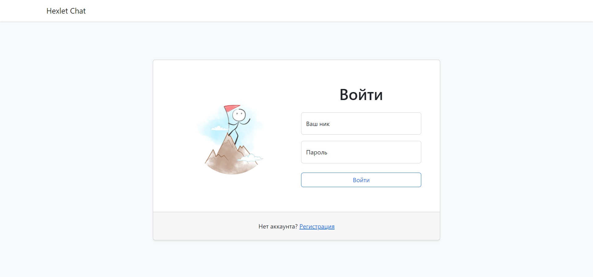
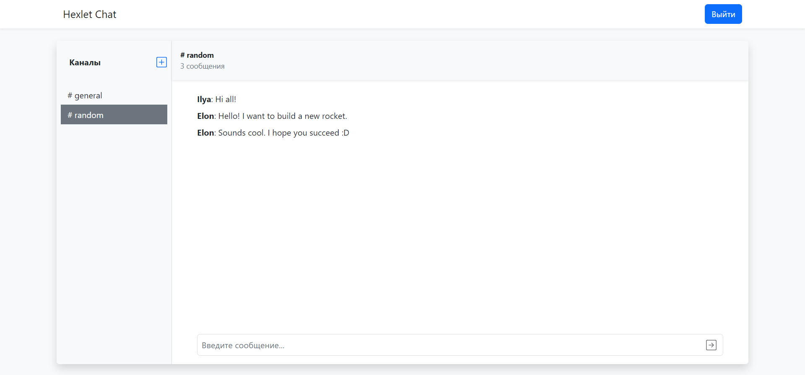
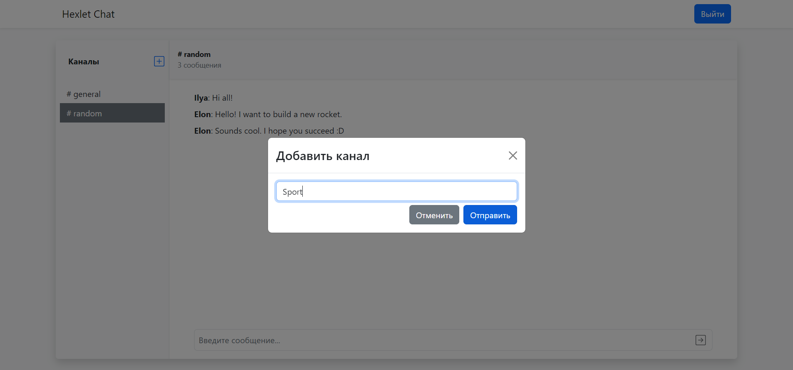

[](https://nodejs.org/en)
[](https://github.com/Frit027/frontend-project-12/actions)

<h1>
    <div align="right">
        <code><a href="#"></a></code>
        <a href="README-RU.md"></a>
    </div>
    Web Chat
</h1>

## About
The repository contains the client part of the web chat with group channels.  
This web application is a list of public channels (chats) available to all registered users.  
After registering, users can communicate in available chats and create their own channels.  
Created channels can be renamed and deleted.

## Demonstration
Below are some demonstration examples of how the site works.
### Login page

### Chat page

### New channel modal


## Installation and Usage
Clone the repository.  
Inside the [frontend](frontend) directory run the command:
```shell
npm i
```
In the project root run the commands:
```shell
npm i
npm run build
npm start
```
Open http://localhost:5001.

## Dependencies
- **Node.js** v16.17.1 or later;
- the server code which is stored in a separate [repository](https://github.com/hexlet-components/project-js-chat-backend).

## Technologies
### Main:
- [ECMAScript 2021](https://www.w3schools.com/js/js_2021.asp)
- [React](https://react.dev/) `[18.2.0]`
- [Redux Toolkit](https://redux-toolkit.js.org/) `[1.9.3]`
- [socket.io](https://socket.io/) `[4.6.1]` - WebSocket client for messaging
### Interface:
- [Bootstrap](https://getbootstrap.com/) `[5.0]`
### Additional tools:
- [i18next](https://www.i18next.com/) - A framework for easy text handling
- [leo-profanity](https://github.com/jojoee/leo-profanity) - Profanity filter
- [Rollbar React](https://docs.rollbar.com/docs/react) - Automatic error checking service
